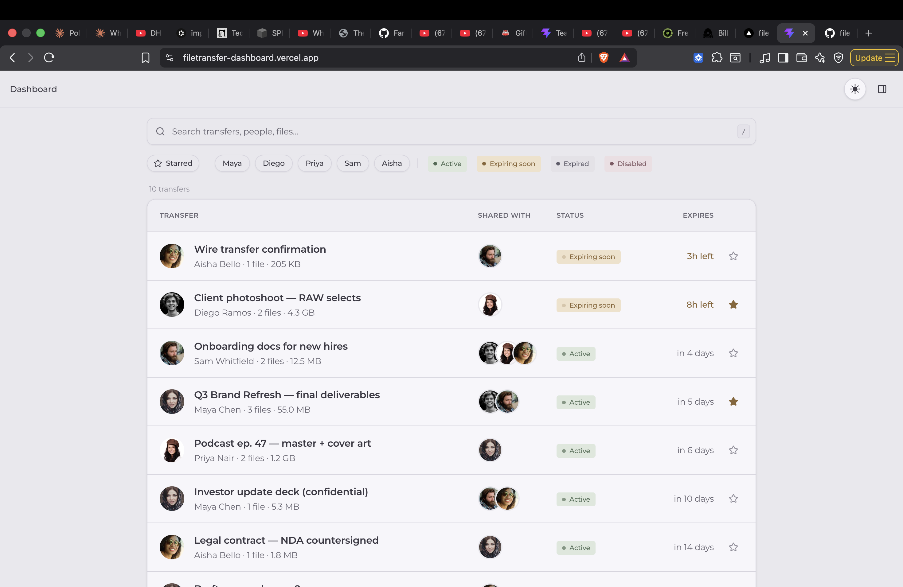
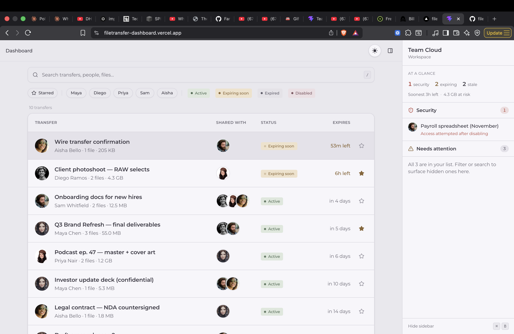
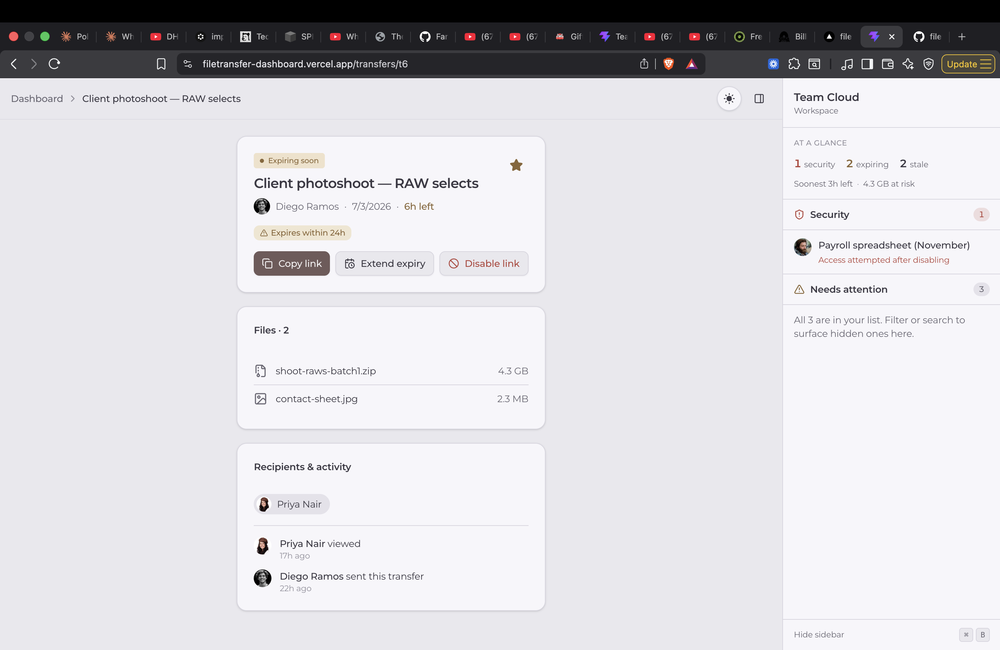
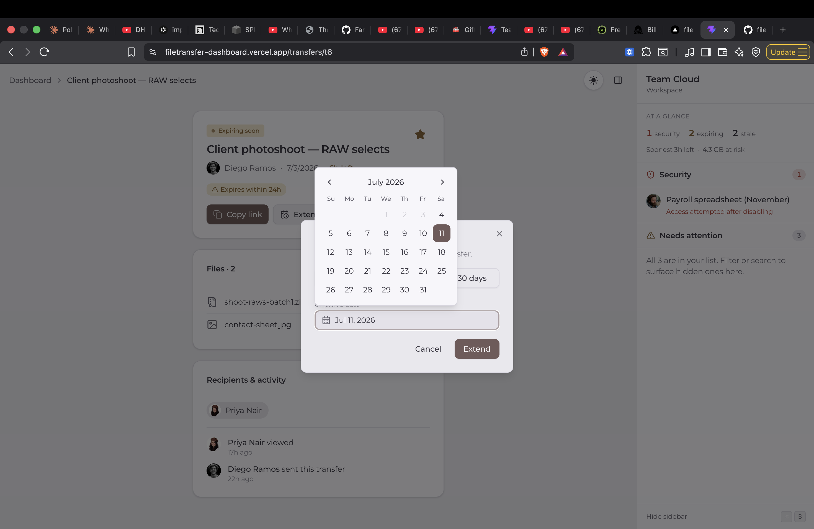

# File Transfer Dashboard

A shared workspace where a team sees file **transfers** sent to and from each
other — status, expiry, who sent what, and what needs attention. The unit of the
product is the **transfer**, not the file.

Mock data only — no backend, no auth, no real upload.

**Live:** [filetransfer-dashboard.vercel.app](https://filetransfer-dashboard.vercel.app)
· **Demo:** [screen recording](docs/screen-recording.mov)

## Screenshots

| Dashboard | Sidebar — At a glance · Security · Needs attention |
|---|---|
| [](docs/screenshots/01-dashboard.png) | [](docs/screenshots/02-sidebar.png) |
| **Transfer detail** — files, recipients & activity, actions | **Extend expiry** — themed calendar |
| [](docs/screenshots/03-transfer-detail.png) | [](docs/screenshots/04-extend-expiry.png) |

## Run

Requires [Bun](https://bun.sh) (npm also works — swap `bun` for `npm run`).

```bash
bun install
bun dev          # http://localhost:5173
bun run build    # typecheck + production build
bun run preview  # serve the production build
bun run lint
```

Stack: **Vite · React 19 · TypeScript · Tailwind v4 · shadcn/ui** (Radix
primitives) · **react-router** · **Fuse.js** (fuzzy search) · **Motion**
(interactions) · **sonner** (toasts) · **lucide-react** · **Montserrat**.

---

## Short note

Decisions, trade-offs, and AI tools used are in **[NOTES.md](NOTES.md)**.

---

## States

Loading (full-shell **skeleton** — sidebar, search, and rows), **empty**,
**no-results** (echoes the query), plus muted **expired** and **disabled**
treatments on the detail screen. → `src/components/States.tsx`.

## Architecture

```
src/
  types.ts       data model — Transfer · FileItem · TeamMember · overrides
  data/          hand-authored mock: 5 members + 10 time-relative transfers
  lib/           logic — deriveStatus, attention rules, fuzzy filter, theme,
                 useTransfers (mock baseline + localStorage overrides + UI state)
  components/    ui/ (shadcn primitives) + screens: Dashboard, Sidebar,
                 TransferList/Row, TransferDetail, FilePreview, modals
  App.tsx        shell — routes ("/" · "/transfers/:id"), sidebar, overlays
  index.css      design tokens (both themes) + animations
```
